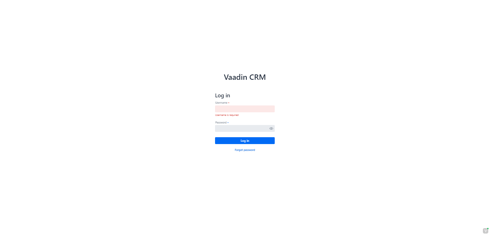
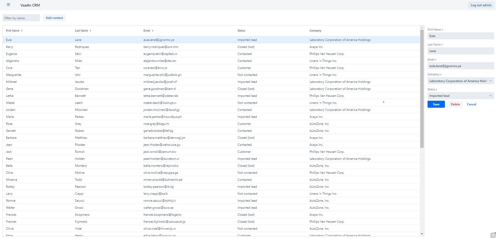

# VaadinCRM

This project is a CRM application using Vaadin with Spring Boot.

## Running the application

The project is a standard Maven project. To run it from the command line,
type `mvnw` (Windows), or `./mvnw` (Mac & Linux), then open
http://localhost:8080 in your browser.

You can also import the project to your IDE of choice as you would with any
Maven project. Read more on [how to import Vaadin projects to different IDEs](https://vaadin.com/docs/latest/guide/step-by-step/importing) (Eclipse, IntelliJ IDEA, NetBeans, and VS Code).

## Deploying to Production

To create a production build, call `mvnw clean package -Pproduction` (Windows),
or `./mvnw clean package -Pproduction` (Mac & Linux).
This will build a JAR file with all the dependencies and front-end resources,
ready to be deployed. The file can be found in the `target` folder after the build completes.

Once the JAR file is built, you can run it using
`java -jar target/VaadinCRM-1.0-SNAPSHOT.jar`

## Project structure

- `views` package in `src/main/java` contains the server-side Java views of your application.
- `data` package in `src/main/java` contains the entities, repositories and services.
- `security` package in `src/main/java` contains the Spring Security configuration and services.
- `views` folder in `frontend/` contains the client-side JavaScript views of your application.
- `themes` folder in `frontend/` contains the custom CSS styles.

## Project Dependencies
1. [Spring Boot](https://spring.io/projects/spring-boot)
2. [Spring Security](https://spring.io/projects/spring-security)
3. [H2 Database](https://www.h2database.com/html/main.html)
4. [Spring Data JPA](https://spring.io/projects/spring-data-jpa)
5. [Spring Boot DevTools](https://docs.spring.io/spring-boot/docs/2.1.5.RELEASE/reference/html/using-boot-devtools.html)
6. [Vaadin](https://vaadin.com/)

## Project Features
1. Login/Logout using Spring Security. You can use root/root for username and password or Admin/root.
   
2. CRUD Operations
   

## Deploying using Docker

To build the Dockerized version of the project, run

```
mvn clean package -Pproduction
docker build . -t VaadinCRM:latest
```

Once the Docker image is correctly built, you can test it locally using

```
docker run -p 8080:8080 VaadinCRM:latest
```
